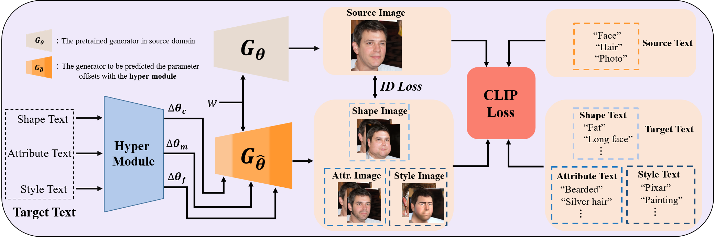

 # <p align="center"> HyperStyle3D: Text-Guided 3D Portrait Stylization via Hypernetworks </p>

#### <p align="center">[Paper](https://arxiv.org/abs/2304.09463v1) | [Project Page](https://windlikestone.github.io/HyperStyle3D-website/) </p>


<p align="center">
  
 </p>
 <p align="center">
  
</p>

# Introduction

This repository contains the official implementation of HyperStyle3D: Text-Guided 3D Portrait Stylization via Hypernetworks.
Our model enables style transfer, attribute editing, shape deformation, and their overlying manipulations under the guidance of text prompts, while preserving 3D consistency. A more detailed introduction can be viewed on our [Project Page](https://windlikestone.github.io/HyperStyle3D-website/).

## :desktop_computer: Requirements

NVIDIA GPUs are required for this project.
We conduct all the training on NVIDIA RTX 3090-24GiB and NVIDIA RTX A6000-48GiB. 
We recommend using anaconda to manage the python environments.

The environment can be created via ```conda env create -f environment.yml```, and activated via ```conda activate hyperstyle3d```.

## :running_woman: Inference

### Download Models

# <p align="center"> Under constructions </p>

The pretrained StyleSDF model can downloaded via [StyleSDF Repo](https://github.com/royorel/StyleSDF)
The pre-trained hypernetworks of several example styles can be downloaded via [Google Drive](https://windlikestone.github.io/HyperStyle3D-website/).
For training, please also download other checkpoints from [Google Drive](https://windlikestone.github.io/HyperStyle3D-website/).
Put the downloaded checkpoints under ```model_zoo``` folder for inference. The checkpoints directory layout should be

    HyperStyle3D
    ├── model_zoo
    │         └── 79999_iter.pth
    │         └── RN50.pt
    │         └── ViT-B-16.pt
    │         └── ViT-B-32.pt
    │         └── model_ir_se50.pth
    │         └── ffhq1024x1024.pt
    │         └── ...
    ├── ZSSGAN
    │        └── model
    │                 └── stylesdf_hyper_style_model.pt
    └── ...


# Inference

In this section, we present an example to generate stylized results via pre-trained StyleSDF and hypernetworks.

```
cd ZSSGAN
bash generate_SDF.sh
bash render_video_SDF_text.sh
```

# Train

```bash
cd ZSSGAN
bash train_stylesdf.sh
```

# Acknowledgement
Thanks to [StyleSDF](https://github.com/royorel/StyleSDF), [StyleGAN-NADA](https://github.com/rinongal/StyleGAN-nada) and [E3DGE](https://github.com/NIRVANALAN/CVPR23-E3DGE), our code is partially borrowing from them.

## :handshake: Citation
If you find our work useful, please consider citing:
```
@ARTICLE{10542240,
  author={Chen, Zhuo and Xu, Xudong and Yan, Yichao and Pan, Ye and Zhu, Wenhan and Wu, Wayne and Dai, Bo and Yang, Xiaokang},
  journal={IEEE Transactions on Circuits and Systems for Video Technology}, 
  title={HyperStyle3D: Text-Guided 3D Portrait Stylization via Hypernetworks}, 
  year={2024},
  volume={},
  number={},
  pages={1-1},
  keywords={Three-dimensional displays;Shape;Generators;Solid modeling;Semantics;Deformation;Deformable models;3D-aware GAN;Style Transfer;Hyper-network},
  doi={10.1109/TCSVT.2024.3407135}}

```
